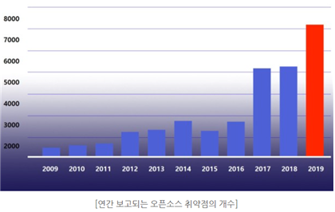

**Table of Contents**:  

  **3.1 Definition of Open Source**  
  Open Source refers to making programming source code accessible for anyone to view and use in the software development process. Common programs we use, such as web browsers, games, chat applications, and word processors, incorporate open source. Notable open source sites include GNU, GitHub, Codeproject, and Codeguru, each with their own licensing policies, ranging from completely free to partially paid with mandatory copyright notices.

  **3.2 Trends/Issues**  
  Currently, there are over 40 million open source projects, and it is expected to increase tenfold by 2026. Today, many developers leverage open source to quickly develop software in line with rapidly changing market demands. However, many fail to recognize the potential security vulnerabilities in open source, believing it is safe as it is publicly managed by many individuals.
  
